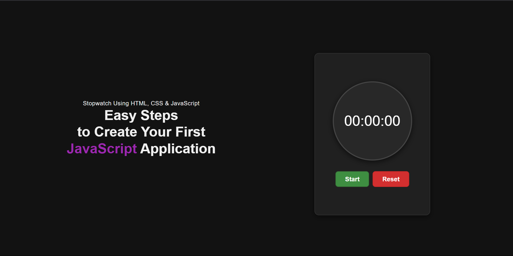

# **UnlokStopWatch**

## **Overview**

**UnlokStopWatch** is a sleek, intuitive, and feature-rich stopwatch application designed to enhance your productivity. Whether you're timing an event, tracking intervals, or just trying to manage your time more effectively, this app offers everything you need in a simple yet powerful interface.

## **Key Features**

### ⏱️ **Start**
- **Begin timing** from zero or the last recorded time with a simple click.
- The stopwatch will **continuously count** up, giving you a precise measurement of time elapsed.
- Ideal for activities where tracking time from a specific point is crucial, such as workouts, meetings, and project tasks.

### 🛑 **Stop**
- **Halt the stopwatch** instantly at the current time.
- Once stopped, the **elapsed time is fixed**, allowing you to capture the time accurately without any additional changes.
- Perfect for tasks where you need to stop the timer at an exact moment, such as taking a break, finishing a task, or ending a session.

### 🔄 **Reset**
- **Clear the current time** and **reset the stopwatch** back to zero.
- This feature is great when you want to start a **fresh session** without any residual time from previous activities.
- It’s especially useful for **repeated tasks** where you want to track multiple intervals.

### ⏸️ **Pause**
- **Pause the stopwatch** temporarily without resetting the time.
- Allows you to **pick up where you left off** once you resume, perfect for interruptions or activities where time measurement is paused momentarily.
- Enables a smooth transition between tasks, ensuring you don’t lose any progress.

---

## **Use Cases**
- **Fitness**: Track your exercise sessions, interval training, or rest times.
- **Productivity**: Time your work sessions using the Pomodoro technique or other task management systems.
- **Cooking**: Perfect for timing recipes, baking, or boiling.
- **Sports**: Track game time, sprints, or training intervals.

---

## **Getting Started**

1. **Start the stopwatch** by clicking the *Start* button.
2. **Pause** it whenever you need a break.
3. **Stop** the timer once you’re done and note the time.
4. Use the **Reset** button to clear the time and start fresh.

---

### **Experience Precision Timing**

Download and start using **UnlokStopWatch** now to make your time tracking easier and more efficient than ever!
